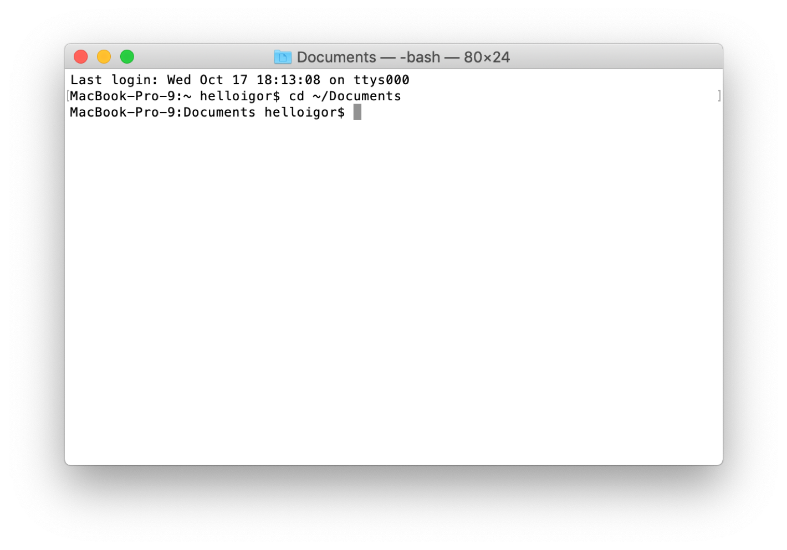

# Introduction

## What is the terminal?

The terminal is this ugly black and white text box. Depending on your operating system (OS), it might look different:





But what's the purpose of it? Well, when you use your computer, you see this nice UI with graphical elements. But the computer can't understand that. It just knows where different icons are placed, and that when you click on one, it should run the corresponding command to run the program you want.

Let's take a concrete example. On Ubuntu, install the Firefox browser (it should be installed by default). If you click on the Firefox icon, it will open a Firefox window. If you want to know what's happening behind the scenes, you can run `firefox` in your terminal. You get the exact same result!
Running the command `start firefox` on Windows (`open -a firefox` on Mac OS) yields the same results.

It's because that's what your system does! It only runs commands.

## Why use the terminal then?

- It's way more powerful than your UI
- It allows you to use tools and do stuff that you cannot do only with your UI.
- More often than not, when you are accessing a server, there will be no GUI. So you'll have to do everything using the terminal.
- When you start using it, it becomes addictive, and it might actually increase your productivity.

## Where to start?

The first step would be to learn how the terminal works.

Let's analyze the first line you see.

#### Linux

```bash
maxim@maxim-computer: ~$
```

What does it mean?!

Calm down, in fact it's simple.

- `maxim`, the leftmost part, is your user session. The one that you connect to when you log into your computer.
- `@` is a separator between the user and the machine's name.
- `maxim-computer:` is your machine's name.
- `~` is the path where you are right now. By default, your terminal starts in your home directory, which is most often located in `/home/<YOUR_USER>`. The symbol `~` is associated to it.
- `$` is to say that you're in normal mode. The other possibility is the symbol `#`. A mode where all the commands are run as `root`. It means as a super-user that has all the rights on your computer. More on that in the **#Sudo** chapter.

On Mac OS this line has a slightly different format:

```bash
maxim-computer:~ maxim$
```

Great! Now you know what that line means! We can move on. You will start typing commands.

#### Windows 

On Windows, it is quite similar.

```cmd
C:\Users\maxim>
```

- `C:\Users\maxim`, is the path where you are right now. Each user has its own folder in `C:\Users\`. `maxim` the leftmost part, is your user session. The one that you connect to when you log into your computer. `C` is just the letter given to one of your disk drives.

NB: There are by default 2 terminals in recent version of Windows, `cmd` and `PowerShell`. We'll be looking at only `cmd`. However, every command listed here also works in `PowerShell`. PowerShell is more recent, is more powerful and contains more commands. We encourage you to use it.

## `man` or `help`

For each command that exists, there is a documentation integrated to the terminal. On Windows, type `help` followed by any command and on Linux / Mac OS, do the same but replace `help` with `man`; it will show you the documentation.

## List files

If you want to know which files and folders are in your current directory (remember, by default you will be in your home directory), you can use the `ls` command on Linux / Mac OS and the `dir` command on Windows.

Try it!

As you can see there are a bunch of files in your home directory like `Desktop`, `Downloads`, `Pictures`,...

**Pro-tip:** You can also add a path after `ls` or `dir`. For example if I want to see the content of the folder `becode` which is in the folder `Desktop`:

```bash
ls Desktop/becode
```

```cmd
dir Desktop\becode
```

Notice that in Windows, we use backslashes `\` in paths, while in Linux / Mac OS we use forward slashes `/`.

## Move

If you want to see what's inside your `Desktop` folder for example, you can tell your terminal to move into this directory. To do so, you can use the `cd` command (on both Windows and Linux) followed by the folder's name you want to go to.

```bash
cd Desktop
```

Now you should see a new folder at the start of the new line:

#### Linux

```bash
maxim@maxim-computer: ~/Desktop$
```

#### Mac OS
```bash
maxim-computer:Desktop maxim$
```

#### Windows
```cmd
C:\Users\maxim\Desktop>
```

It shows you where you are in your machine. Try listing your files now. Are there any files on your Desktop?

If not, let's create one!

To go up a folder in the directory structure you can use

```bash
cd ..
```

**Pro-tips:** (Linux and Mac OS only) If you want to come back to your `home` directory, type `cd` alone. It will do the job.

## Create a file

On Linux and Mac OS, to create a file you can type `touch` followed by your file's name.

Let's create a `test.txt` file on your desktop

```bash
touch test.txt
```

Now you can do `ls` to see if the file has been created.

The same command for Windows is the following

```cmd
type nul > test.txt
```

## Create a folder

If you want to create a new folder, you can use the `mkdir` command followed by the directory's name. This is the same on all platforms.

```bash
mkdir test_folder
```

```cmd
mkdir test_folder
```

## Remove a file

You don't want our test file and directory to stay there forever.
To delete them, you can use the `rm` command for Linux / Mac OS or the Windows `del` command followed by your file/folder. If you try to delete a folder or a folder that contains files you will get an error. I let you Google what has to be done to do actually delete the folder.

## Find a file

Let's say you are in a folder that contains a lot of other folders and files, and you know that there is a file somewhere that contains `becode` in its name.

You could use `find` on Linux / Mac OS or `dir /s` on Windows.

## Show file contents

From the terminal, you can print the content of a file using the command `cat` on Linux / Mac OS or the `type` command on Windows.

```bash
cat myfile.txt
```

```cmd
type myfile.txt
```

## Find a line in a file

You want to find a word inside a file?
Just use `grep` !

For example if I want to see if my file contains `learning`, I could type:

```bash
grep "learning" myfile.txt
```

The Windows equivalent is `findstr`

```cmd
findstr "learning" myfile.txt
```

## Sudo

Some commands will need some elevated privileges to be executed. For example, if you want to install a new software.

On Linux and Mac OS, it is quite easy to do so in your terminal. Your computer will ask you to run the command as `sudo`, which means as administrator of the system (also called root).

Do to that, just run the command with `sudo` prepended: `sudo <YOUR_COMMAND>` (super-user do <YOUR_COMMAND>).

**Pro Tips:** If you want to apply sudo to the last command you typed, try using the following:

```bash
sudo !!
```

It will re-run the last command with sudo in front.

On Windows, there is also a possibility to elevate the privileges with a (few) simple keyword(s): `runas /user:<LOCAL_MACHINE_NAME>\administrator <YOUR_COMMAND>`
