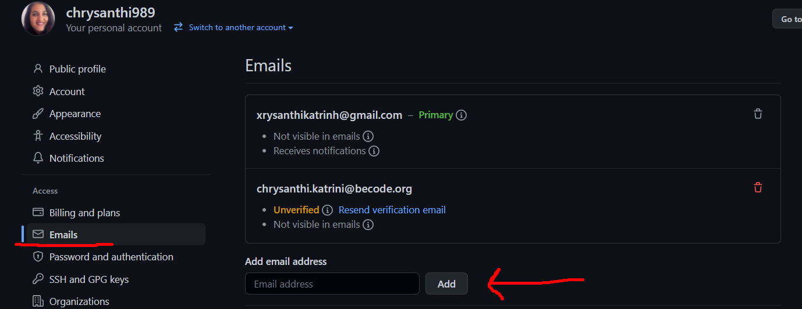
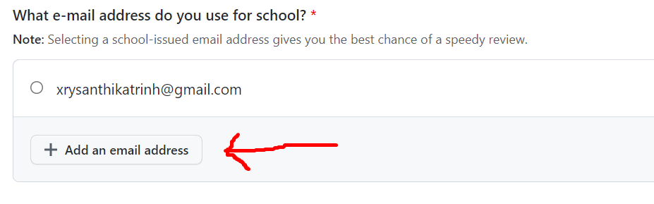
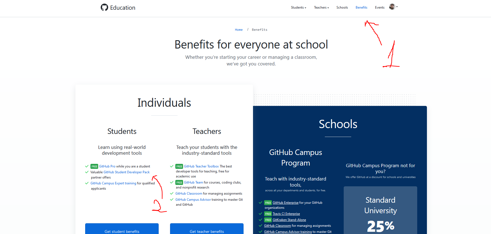
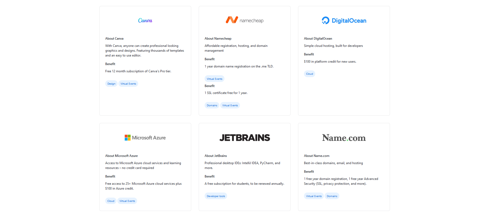

# GitHub Student Developer Pack

### Step 1

Have an active GitHub account.

### Step 2

Add in your GitHub profile the BeCode alias you have received from BeCode (you can find that in your profile in mybecode, it looks like "yourname@becode.xyz").

Note: Make sure you verify your email address. You can find the email in the email address you have declared in the form when you joined BeCode.

### Step 3

Go to [GitHub Education](https://education.GitHub.com/pack/join)

### Step 4

Fill in the details asked BUT pay attention to choose and/or add the BeCode alias.

### Step 5

You are in! Now click as the image shows to see your benefits.

Sneak peek:

# ENJOY!