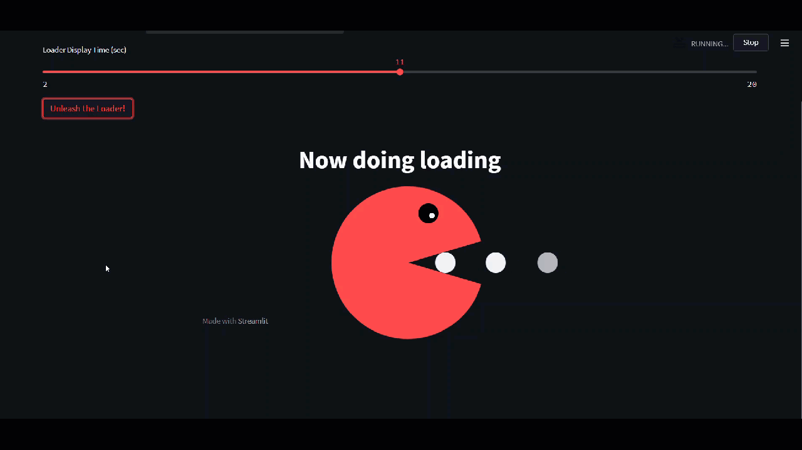
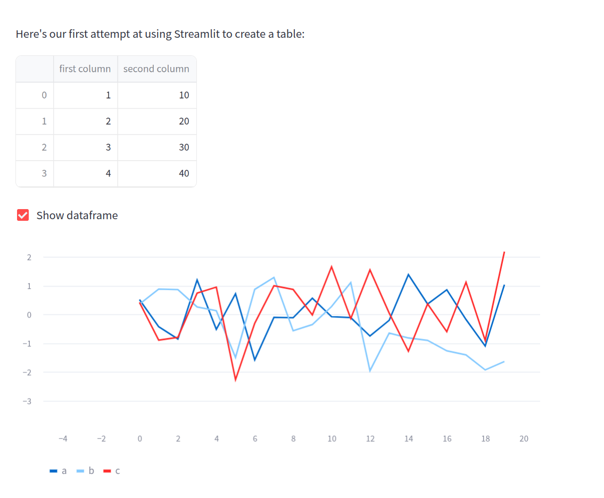

# Hosting services: the basics

1. [What's a Web App?](#introduction)
2. [Render](#render)
3. [Streamlit](#streamlit)
4. [Cloud Services](#big-cloud-providers)

## Introduction

When your code is running and you would like people to be able to use it, they are many ways to do it. You can package it as a standalone application or you can deploy it as a web application.
When it comes to deploying your API (also called, web-server), a lot of solutions exists.

Each with the set of services, facilities and prices.


## Render

Render is a cloud platform that simplifies the deployment of web applications, APIs, databases, and static sites. It provides an all-in-one solution for developers to deploy, manage, and scale their applications with minimal configuration and effort. Render offers various services, including web services, static sites, background workers, cron jobs, and managed databases.

**Why is it intersting ?**

- Easy Deployment: Deploy web applications and static sites directly from your Git repositories with automatic builds and deploys on every push.
- Scalability: Automatically scale your applications based on traffic and resource usage.
- Managed Databases: Easily set up and manage PostgreSQL databases with automatic backups and scaling.
- Custom Domains: Securely manage custom domains with free TLS certificates.
- Monitoring and Logging: Integrated monitoring and logging tools to keep track of your application's performance and troubleshoot issues.

**How to start ?**

Go checkout the [next file](02-hosting-render.md)

## Streamlit


[Streamlit](https://streamlit.io/) is an open-source Python library designed to simplify the process of creating web applications for data science and machine learning projects. It allows data scientists and machine learning engineers to create interactive and visually appealing web applications directly from Python scripts, without requiring any knowledge of web development technologies like HTML, CSS, or JavaScript.

**Why is it interesting ?**

- Easy to Use: Streamlit’s API is intuitive and easy to learn, making it accessible even for those with minimal programming experience.
- Interactive Widgets: Add interactive widgets like sliders, dropdowns, and buttons to your app with simple commands.
- Live Updating: Streamlit automatically updates the app in real-time as you modify your script.
- Integration: Seamlessly integrates with popular data science libraries like Pandas, NumPy, Matplotlib, and Plotly.

**How to start ?**

`pip install streamlit` 

```python
import streamlit as st
import pandas as pd
import numpy as np

st.title('Simple Streamlit App')

st.write("Here's our first attempt at using Streamlit to create a table:")
st.write(pd.DataFrame({
    'first column': [1, 2, 3, 4],
    'second column': [10, 20, 30, 40]
}))

if st.checkbox('Show dataframe'):
    chart_data = pd.DataFrame(
       np.random.randn(20, 3),
       columns=['a', 'b', 'c'])

    st.line_chart(chart_data)

```



Checkout the available documentation and tutorials : 

- [streamlit documentation ](https://docs.streamlit.io/)
- [Streamlit tutorial](https://docs.streamlit.io/develop/tutorials)
- [Streamlit tutorial geeksforgeek](https://www.geeksforgeeks.org/a-beginners-guide-to-streamlit/)


**How to practice ?**

To practice the app deployement with streamlit, you can : 
- deploy your hangman project
- deploy you vizualisation from the immo eliza project


## Big cloud providers

Another possibility to deploy an application, and what will mostly be used in big companies is cloud providers. The 3 mains ones are:
- Amazon Web Services (AWS)
- Microsoft Azure (AZ)
- Google Cloud Platform (GCP) 

Each of those gives you the possibility to manager your own Linux machine and expose it to the internet.

So you can run API, ML models, ...

But this kind of service is expensive and not easy to manage. You have to update the OS regularly, configure a firewall, set-up the security, ...

To make the process of deploying all the "common" services (API, web app, website,...) they have specific services that you can use with less configuration more ease.

In this course, we don't use cloud providers that much because a lot of free alternative exists, but for bigger projects it's good to be aware of what is out there.

**For APIs, here are some interesting solutions:**

- [AWS API gateway](https://docs.aws.amazon.com/apigateway/latest/developerguide/how-to-deploy-api.html)
- [AWS Lambda](https://aws.amazon.com/lambda/)
- [Azure API](https://azure.microsoft.com/en-gb/services/api-management/#overview)
- [Azure functions](https://docs.microsoft.com/en-us/azure/azure-functions/functions-overview)
- [Googe API](https://cloud.google.com/endpoints/docs/openapi/deploy-api-backend)
- [Google Cloud functions](https://developers.google.com/learn/topics/functions#:~:text=Google%20Cloud%20Functions%20is%20a,your%20cloud%20infrastructure%20and%20services.)

**For raw servers:**

### AWS EC2

[Amazon Elastic Compute Cloud](https://aws.amazon.com/ec2/) (Amazon EC2) is a web service that provides secure, resizable compute capacity in the cloud. It is designed to make web-scale cloud computing easier for developers. Amazon EC2’s simple web service interface allows you to obtain and configure capacity with minimal friction. It provides you with complete control of your computing resources and lets you run on Amazon’s proven computing environment.

AWS has been around for quite some time now and allows you do to pretty much everything, like the [AWS S3 servers](https://aws.amazon.com/s3/?nc1=h_ls) that provides storage and fast computing capabilities and thus very useful to train Neural Networks. AWS certifications are also really valuables by a lot of companies.

The huge challenge is learning how all those services works. You can take a look at [Amazon Elastic Beanstalk](https://aws.amazon.com/elasticbeanstalk/?nc1=h_ls) .

**Please be careful because the pricing can escalate pretty quickly.**

[Deploy Flask app on AWS EC2 tutorial](https://www.codementor.io/@dushyantbgs/deploying-a-flask-application-to-aws-gnva38cf0)

### Azure

[Microsoft Azure Container Instances](https://azure.microsoft.com/en-us/services/container-instances/) also allows you to run containers on their platform.

Microsoft Azure is one of the most used Wep Application Service, like Amazon's AWS and the certifications are also highly valuable for companies.

[Deploy Flask app on Azure tutorial](https://medium.com/@alexjsanchez/creating-and-deploying-a-flask-app-with-docker-on-azure-in-5-easy-9f7aa7a12145)

**Please be careful because the pricing can escalate pretty quickly.**

This section is mainly for your information, you don't need to practice deploying applications on cloud services.