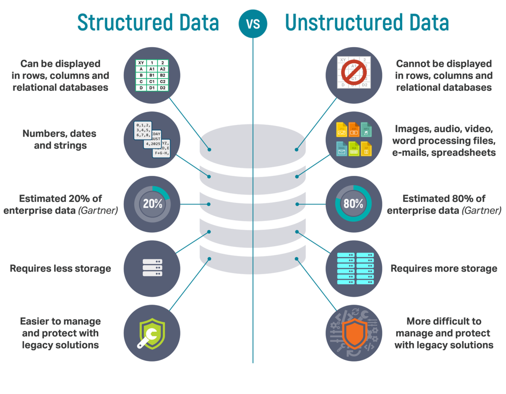

# Introduction

## What is *structured data*?

*Structured data* is the kind of data that you have manipulated until now.

This data is in a fixed schema and mostly represented in a tabular form. The schema imposes constraints on the data to make it consistent and computable.

A typical example of structured data is a relational database, one that is queried using SQL.

However, other types of structured data exist. A prominent example is the `json` format, that you find everywhere on the web.

*Unstructured data* on the other hand is data that doesn't conform to a particular format, or a collection of data holding many different data types. For example, a PDF file is unstructured data.

## What is *Deep Learning*?

*Deep learning* is a subset of machine learning that makes use of prediction model that are related to how a biological neuron functions. These are called **artificial neural networks**.

I'll let you explore more of it in [this excellently written article](https://www.ibm.com/cloud/learn/deep-learning) by IBM.
