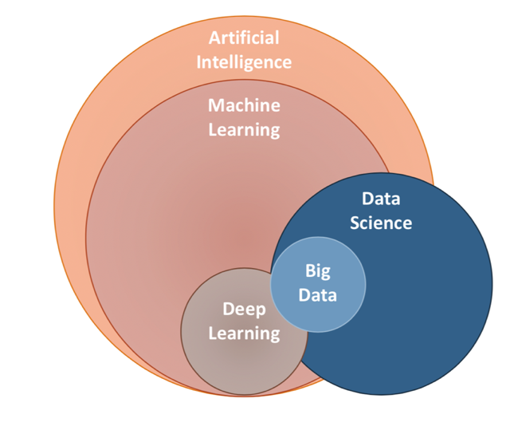

# Machine Learning

## Introduction to Machine Learning

What is machine learning (ML), why do we need and how do we use it?

Let's start by giving a short definition. Machine learning is an application of artificial intelligence (AI) which can learn and improve from experience without human intervention. The scope is to develop programs that can manipulate data and self-learn from them.

The learning stage starts by observing the data and try to find patterns in them so the decisions can based on these examples. 

For now we will focus on Machine Learning but there are other topics that are blended all together such as Deep Learning, Artificial Intelligence, Data Science and Big Data. The differences on these topics are hard to spot even for more experienced users. Here is a diagram to place them into yoru mind. 

Machine learning itself is often categorized into:
  - [**Supervised Machine Learning algorithms**](https://www.datarobot.com/wiki/supervised-machine-learning/) can classify and process [labeled data](https://www.techopedia.com/definition/33695/labeled-data) which are datasets that has been classified. 

  - [**Unsupervised Machine Learning algorithms**](https://www.datarobot.com/wiki/unsupervised-machine-learning/) are used when the data are neither classified nor labeled. 

  - [**Semi-supervised Machine Learning algorithms**](https://www.datarobot.com/wiki/semi-supervised-machine-learning/) can be placed between supervised and unsupervised techniques as we are talking for dataset where a part of it is labeled and the rest not. 

  - [**Reinforcement Machine Learning algorithms**](https://www.geeksforgeeks.org/what-is-reinforcement-learning/) or known as agent, is part of the Deep Learning method and it is a "game" of reward and punishment as it interact a lot with its environment. I know , I know, it is complicated for now, but when you moved to the DL part of the course, it will make more sense.  

There are unique techniques for each of these learning categories. Here are some: 

## Business application of ML

Every day more and more business involve ML in their businesses as they are seeing the added value to their problems. [Here](https://www.dezyre.com/article/top-10-industrial-applications-of-machine-learning/364) you can find some of the latest industrial Applications to give you an idea of how powerful ML is. There is a huge range of use cases and below you can find some examples: 

<!-- #region -->
## Challenges of using ML

Therefore we can all see how handy this can be , ML is a complicated technology to use and requires some expertise to handle it. This brings some challenges in place, which we as developers need to take good care of to make sure we are using its capabilities at a full mode. 

- One very common difficutly we are coming across is to try to enforce ML to each problem. As fascinating as it can be to use it, not all the problems requires such complicated algorithms to be solved which often leads to failure to deliver results. 
- Data is the key to ML and the choice can be hard but can bring certainty to our results.
- [Bias](https://techcrunch.com/2018/11/06/3-ways-to-avoid-bias-in-machine-learning/?guccounter=1&guce_referrer=aHR0cHM6Ly93d3cuZ29vZ2xlLmNvbS8&guce_referrer_sig=AQAAAIc9orVXIUcDKYfTZEahCwp1KnypjjsQnSfImtdXI4lhi0QSW8VLZkacEZdBrK55NMb6K6_JK2o4eaUc14a5sWuYxIvQVp_s32hd8aWqsdgbfjszHGcv8HQaduKdQOQLMvlJO4ZHhT6w4NQ1xLAGzaDOWO_vbTV_CAhsICAmTdW2) can totally transform, filter and enhance the dataset. There are 2 categories of bias and bith can lead to inaccurate models.
- [Black box functionality](https://y-sbm.com/blog/black-box-in-machine-leraning) is one reason why bias is so prevalent in machine learning. A lot of ML algorithms are operating in ways that can be often described as black box. This brings the developer to a position that he/she cannot determine what exactly is happening when as the algorithm makes observations and then produce an output with no details. 

## Steps of a ML model 

Here is an outline of the process in a few steps:

<!-- #endregion -->

### Vendor Tools

- **Amazon Sagemaker** is a cloud-based tool that allows users to work at a range of levels of abstraction. Users can run pretrained algorithms for simple workloads or code their own for more expansive applications.

- **Google Cloud** is a collection of services that range from plug-and-play AI components to data science development tools.IBM Watson Machine Learning is delivered through the IBM cloud and allows data scientists to build, train and deploy machine learning applications.

- **Microsoft Azure Machine Learning Studio** is a graphical user interface tool that supports building and deploying machine learning models on the Microsoft cloud.

### Open source

- **scikit-learn** is an open source library of Python code modules that allow users to do traditional machine learning workloads like regression analysis and clustering. It has [this really nice course](https://inria.github.io/scikit-learn-mooc/toc.html) to explore machine learning!
- **TensorFlow** is a machine learning platform built and open sourced by Google. It is commonly used for developing neural networks.
- **Theano** was originally released in 2007 and is one of the oldest and most trusted machine learning libraries. It is optimized to run jobs on GPUs, which can result in fast machine learning algorithm training.
- **Torch** is a machine learning library that is optimized to train algorithms on GPUs. It is built primarily to train deep learning neural networks.
- **Caffe** is a framework is specifically engineered to support the development of deep learning models -- in particular, neural networks.

And now I can see the terror in your eyes! "Will we deal with all these? How do we know which is what? We will be confused for sure. Please take me out of here, I promise I will be a good person from now on". As you already know, learn by doing is the best way, so let's go for it! 

