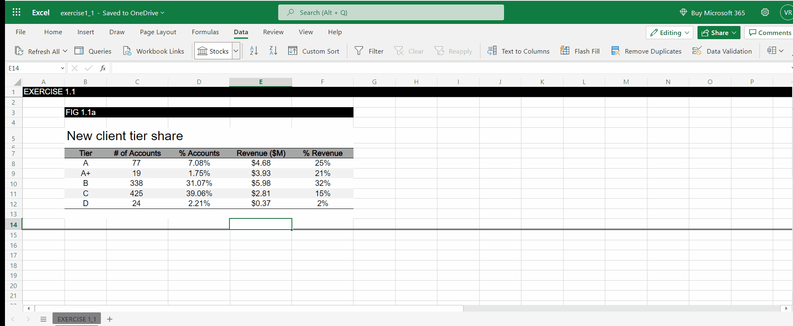
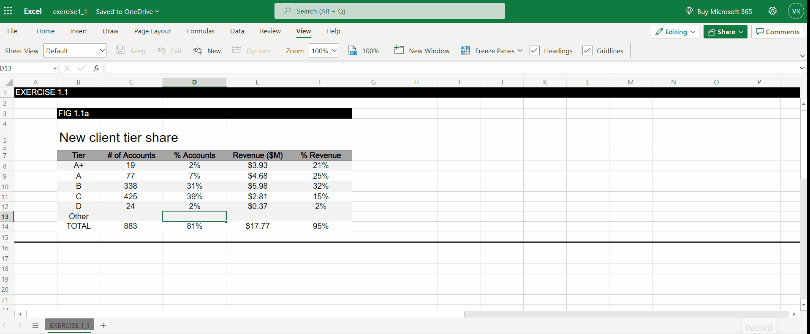

# Getting started with Microsoft Excel 

Every Excel workbook exists within a larger data ecosystem. This includes other workbooks that may be from other users and database systems, such as ERPs, CRMs, and other operational systems. Each of these systems contains organizational data and is important to understand how all these relate in the larger data lifecycle.

One of the main advantages of Excel is it's wide spread use. While it has a great amount of features, we will focus through an end-to-end solution for collecting, cleaning, importing, managing, and sharing data for operational and reporting purposes using Excel.

Our goal is to beyond the particular features of Excel and delvelop our story-telling with data skills through exercises.

## Quick calculations to explore our data

### Exercise 1-1: Improve this table

Frequently, when we first aggregate our data, we put it into a table. For this exercise, we'll be using the [Exercise 1.1 worksheet](./data/exercise1-1.xlsx), which shows the breakdown of new clients by tier for the recent year.

1. Review the data in the table. What observations can you make? Do
you have to make any assumptions when interpreting this data? What questions
do you have about this data? Write them down.
2.  Let’s assume you’ve been told this information must be communicated in a table. Are there any changes you would make to the way the data is presented or the overall manner in which the
table is designed? 
3. Let’s assume the main comparison you want to make is between how
accounts are distributed across the tiers compared to how revenue is distributed—
and that you have the freedom to make bigger changes (it’s not required to be a
table). How would you visualize this data? 

### One approach

After opening our file we can look at our data,


We notice a few things:

1. **Misleading hierarchies:** The `A+ Tier` is below the `A Tier` which is counter intuitive. Use the `Sort Descending` feature to address this.
2. **Too many details**: The `% Accounts` column rounds the percentages to two decimal points. This can clutter our table without adding value. `Use the decrease decimal` feature to address this.
3. **A lack of summary**: Having the total values of the columns could give use insights on the big picture of our clients and provide a way to check our data for inaccuracies (e.g. percentages should add to 100%). Use the `SUM()` function to address it. **Note:** To make calculations in a cell you must include the `=` sign to execute it. 




**Note** that by addind our `Total` row, there are some inconsistencies in our data. 

4. Add a new row,  `Other`, that captures the rest of the clients that don't fall in any of our previous Tiers.

    a. Getting the percentages is not too hard! We can substract from 100% the total sum for the `%Account` and `%Revenue` to obtain the percentage for the `Other` new client tier. 

    

    b. One way to get the `# of Account` and `Revenue($M)` is to update our `Total # of Accounts` using the formula below, 

   ```Total # of Accounts`*(95%) = 883``` 

    so that, 
    
    ``` Total # of Accounts` = 883/(95%)```

    And, compute 19% of that amount! Do the same for the revenue column. 


Don't forget to update your % totals.

**Warning:** When doing cell dependent calculations we must avoid circular references. Read more [here](https://www.makeuseof.com/what-is-circular-reference-excel/).

There are many ways to fix this issue! In our case we will, adapt our computations to remove the circular references, by updating how we do our calculations, and make sure to copy only the values in certain cells. 

a. First, we compute the missing percentages, `Copy` the cell, and make sure to `Paste` it using the `Value` option. Now we can update our percentage totals!


b. Then, we can recompute the missing the amount totals. One way would be to use the following formula (why?),

`SUM(Previous Amount Rows)/SUM(Previous Percetages Rows)`


c. So now, we can compute the missing amounts directly!


Much better, ain't it!

## Choosing an effective visual: 

Now that we've improved our table, let see a few ways to visualize it!

There is no single right answer when it comes to how to visualize data. Any data
can be graphed countless different ways. Often, it takes iterating—looking at the
data one way, looking at it another way, and perhaps even another—to discover a
view that will help us create that magical 'ah ha' moment of understanding that graphs done well can do. 

## Heatmaps with conditional formatting

If we assume the primary comparison we’d like our audience to make is between
the distribution of `% Accounts` compared to `% Revenue`, I could apply heatmapping (using relative intensity of color to indicate relative value) to just those two columns.

To do this in Excel, we'll use conditional formatting. 

1. Select the appropiate cells. 
2. On the Home tab, in the `Styles` group, click `Conditional Formatting`.
3. Select `Color scales` and pick an appropiate gradient!

That's it! You can explore other types of conditional formatting options to see if others fit best.


## Bar charts

By creating a bar chart we can compare to quantities visually. 

To make one with Excel, it's pretty straight forward.

1. Select the relevant columns.
2. On the `Insert` tab, you will see many options for charts. Choose the horizantal bar chart.
3. You can double-click in any of the chart elements to edit. It will open a side menu of options to customize you chart. 


## Pie Chart

While it's not the favorite of many, pie charts are still widely used to make comparisons.

Pies can work well if we want to make the
point that one piece of the whole is very small, or another piece of the whole is
very big. The challenge for me is that pies break down pretty quickly if we want to say anything more nuanced than that. This is because our eyes’ ability to accurately measure and compare areas is limited, so when the segments are similar in size, it is difficult for us to assess which is bigger or by how much.

To create a pie-chart in Excel, you can repeat the same steps as before (this time only picking one column at a time)  and choose it from the menu. 


## More inspiration for effective visuals

There are many additional resources out there when it comes to choosing an
effective graph or getting inspiration from other people’s creations. Practicing,
getting feedback, and iterating are keys to success. That said, here are a few chart
choosers I’m aware of that you may find helpful when it comes to figuring out
what graphs might work for your specific needs:

* [Chart Chooser (Juice Analytics)](labs.juiceanalytics.com/chartchooser): Use
their filters to find the right chart type for your needs, download as Excel
or PowerPoint templates and insert your own data.

* [The Chartmaker Directory (Visualizing Data)](chartmaker.visualisingdata.com): Explore the matrix of chart type by tool and click the circles to see solutions and examples.
*  [Graphic Continuum  (PolicyViz)](policyviz.com/?s=graphic+continuum): The
poster includes more than 90 graphic types grouped into six categories.
Also check out the related Match It Game and Cards.
* [Interactive Chart Chooser(Depict Data Studio)](depictdatastudio.com/charts): Explore the interactive chart chooser using filters.


## Additional Resources

* [The Basic Excel Formulas Everyone Needs to Know](https://www.datacamp.com/tutorial/basic-excel-formulas-for-everyone)
* [Conditional Formatting](https://www.excel-easy.com/data-analysis/conditional-formatting.html)