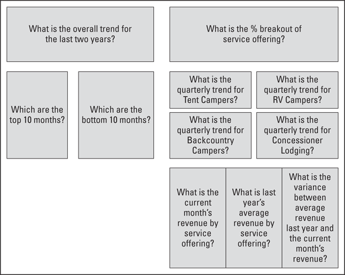
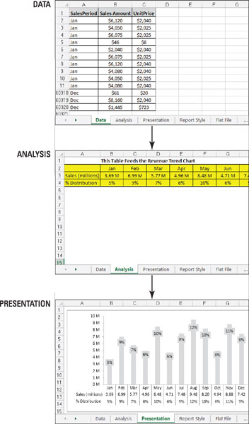

## Dashboarding with Excel: Best Practices

In this section, we'll explore  some best practices for setting up the source data for your dashboards and reports and explore the key Excel functions that help you build effective dashboard models.

In particular, we'll explore how pivot tables can enhance your analytical and reporting capabilities as well as your dashboards.

## Defining Dashboards and Reports

It isn’t difficult to use report and dashboard interchangeably. However, in  practice there are noticible difference in how we approach building and using them. 

The **report** is probably the most common application of business intelligence. A report can be described as a document that contains data used for reading or viewing. It can be as simple as a data table or as complex as a subtotaled view with interactive drill-downs, similar to Excel’s Subtotal or Pivot Table functionality.

The key attribute of a report is that 
**it doesn’t lead a reader to a predefined conclusion**. Although reports can include analysis, aggregations, and even charts, reports often allow for the end users to apply their own judgment and analysis to the data.

A **dashboard** is a visual interface that provides at-a-glance views into key measures relevant to a particular objective or business process. Dashboards have three main attributes:

* Dashboards are typically graphical in nature, providing visualizations that help focus attention on key trends, comparisons, and exceptions.
* Dashboards often display only data that are relevant to the goal of the dashboard.
* Because dashboards are designed with a specific purpose or goal, they inherently contain predefined conclusions that relieve the end user from performing his own analysis.

It might sound simple, but knowing well the differences between the two will ensure that you communicate effectively as a Data Analyst. 

## How do we do it using Excel?

To build dashboards and reports many use business intelligence tools such as PowerBI or Tableau.

So here we'll focus on best practices and an simple example. Our goal with our dashboard is that every visualization present answers a relevant business question (see the example below).

Each box in this dashboard layout mockup represents a component on the dashboard and its approximate position. The questions within each box provide a sense of the types of data required to create the measures for the dashboard.

### Does it always start from data?

Through our training, we've often started from a dataset and interrogated it with our visualization powers!

In practice, you may start first with the questions that you wish to answer first and take a catalougue of your data resources. Ask yourself the following questions before builfing your dashboard:

* Do you have access to the data sources necessary?
* How often are those data sources refreshed?
* Who owns and maintains those data sources?
* What are the processes to get the data from those resources?
* **Does the data even exist?** (sometimes it does not, and this is valuable insight for your client!)

## What’s a data model? 

A data model provides the foundation upon which your reporting mechanism is built. When you build a spreadsheet that imports, aggregates, and shapes data, you’re essentially building a data model that feeds your dashboards and reports.

A good data model makes your life easier by automating your reporthing mechanisms!

## Best Practices

Rather than see only the finished dashboard in your head, try to think of the end-to-end process. 

* Where will you get the data? * How should the data be structured? 
* What analysis will need to be performed? 
* How will the data be fed to the dashboard? 
* How will the dashboard be refreshed?

Below you'll find some best practices.

### **Separate data, analysis, and presentation**

For example, avoid hard-coded tables that fuse data, analysis, and presentation. We all ready saw an example in our previous chapter on how this can really mess our calculations and reporting!

Ideally, your data process would look like this:

You can think of these layers as three different worksheets in an Excel workbook: one sheet to hold the raw data that feeds your report, one sheet to serve as a staging area where the data is analyzed and shaped, and one sheet to serve as the presentation layer. 

There are a couple of benefits to this setup. 

* First, the entire reporting model can be refreshed easily by simply replacing the raw data with an updated data set. The formulas on the Analysis tab continue to work with the latest data. 
* Second, any additional analysis can easily be created by using different combinations of formulas on the Analysis tab. 
* If you need data that doesn’t exist in the Data sheet, you can easily append a column to the end of the raw data set without disturbing the Analysis or Presentation sheets.

### **Starting with appropriately structured data**

Not all data sets are created equal. Although some data sets work in a standard Excel environment, they may not work for data modeling purposes. 

Before building your data model, ensure that your source data is appropriately structured for dashboarding purposes. In general, Excel come in three fundamental forms:

* The spreadsheet report
* The flat data file
* The tabular data set

### **Avoiding turning your data model into a database**

In an effort to have as much data as possible at their fingertips, many Excel users bring into their spreadsheets every piece of data they can get their hands on. They essentially build a database in their spreadsheet.

`What’s wrong with utilizing as much data as possible?`

Well, this increases the number of formulas you will need to aggragate the data, it can degrade the performance of your dashboard by slowing down the loading process, and it leads to loosing scalability. 

These are all issues that can be avoided by importing only aggregated and summarized data that’s useful to the core purpose of your reporting needs.

### **Testing your data model before building reporting components on top of it** 
This best practice is simple. Make sure your data model does what it’s supposed to do before building dashboard components on top of it. In that vein, here are a few things to watch for:

* **Test your formulas to ensure they’re working properly.** Make sure your formulas don’t produce errors and that each formula outputs expected results.
* **Double-check your main data set to ensure it’s complete.** Check that your data table was not truncated when transferring to Excel. Also, be sure that each column of data is present with appropriate data labels.
* **Make sure all numeric formatting is appropriate.** Be sure that the formatting of your data is appropriate for the field. For example, check to see that dates are formatted as dates, currency values are formatted properly, and the correct number of decimal places is displayed where needed.

The obvious goal here is to eliminate easily avoidable errors that may cause complications later.

Now, that you've reviewed some best practices, you are ready to apply them in any tool!

Take a look at the following tutorial and put some of those best practices to work! How would you improve their dashboards?

* [How to Make a Dashboard in Excel: Step-by-Step Guide (2022)](https://spreadsheeto.com/dashboard-excel/)

