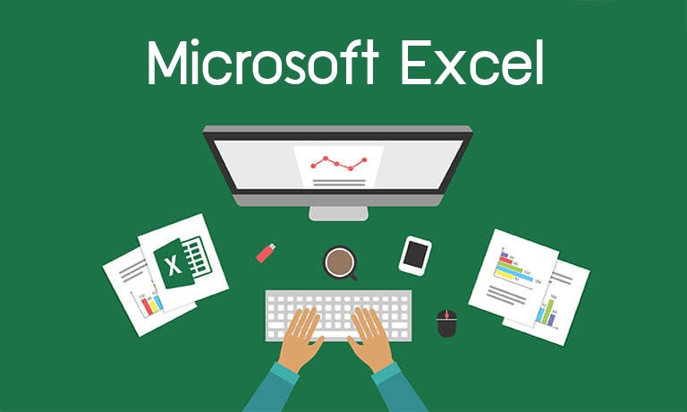

# Excel 

Probably one of the most used and oldest Data Analysis tool. Microsoft developed Excel mostly for spreadsheet calculations and today, it is widely used for data processing, visualization, and complex calculations.

Excel comes with various formulas, tables, filters, slicers, etc. You can also create your own custom functions and formulae using Excel. While Excel is not for calculating the huge amount of Data, it is still an ideal choice for creating powerful data visualizations and spreadsheets.

You can also connect SQL with Excel and can use it to manipulate and analyze data. A lot of Data Scientists use Excel for data cleaning as it provides an interactable GUI environment to pre-process information easily.

## Installation and Use

As many Microsoft tools, Excel requires a license. However, you are free to use the online version available at [Office.com](www.office.com) by creating a Microst account. 

## Other Alternatives 

Other spreadsheet programs that are currently available for use include:

* [Google Sheets](https://www.google.com/sheets/about/): A free web-based spreadsheet application.
* [Open Office Calc](https://www.openoffice.org/product/calc.html): A spreadsheet program that is available for free download.
