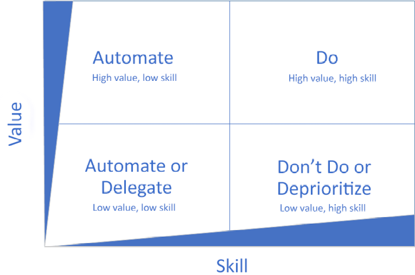

# Introduction to Power Automate

As with most data analysis tools, loading and connecting to data sources is not enough to start you analysis. 

Data can be messy and can require some manipulation before making to your dashboard or model. In this section, we will discuss Power Query, and particular, Power Automate and it's interaction with Excel. 

## What is Power Query?

Power Query is a data transformation tool available in both Microsoft Excel and Power BI.

Power Query comes with a graphical interface for getting data from sources and a Power Query Editor for applying transformations. Because the engine is available in many products and services, the destination where the data will be stored depends on where Power Query was used. Using Power Query, you can perform the extract, transform, and load (ETL) processing of data.

Power Query allows you to load multiple data sets into its editor. Within the editor, there are various Ribbon buttons you can click to remove duplicates, delete rows, format dates, etc… just to name a few. Many data-manipulating automations that were only possible through VBA coding can now be easily replaced via the Power Query tool.

Power Query is not a standalone tool; it can be used inside different tools in two different versions: Power Query Desktop and Power Query Online. The first version is available in Excel, Power BI, and SQL Server Analysis Services, while the second is available in the Power BI service, Power Apps, Power Automate, Azure Data Factory, Azure Synapse, and Dynamics 365 Customer Insights.

## Power Automate

Power Automate (formerly known as Microsoft Flow) is primarily a web-based tool designed to interface with a growing library of software from both Microsoft and other vendors. Due to its no-code/low-code design, Power Automate can be approached by individuals with any technical skill level—including office or business users with no coding experience, system administrators, and programmers.

In this section, we will focus on Power Automate as it is freely available with your online Microsoft office account.

To access Power Automate, from your home screen you can click More Apps and click on the icon or search for it using the search bar on the top of the page. 

## Choosing what to automate

Frequently, people do work that they don’t need to do. It’s important to differentiate between work that doesn’t need to be done at all and work that needs to be done, but doesn’t require you to do it.

From both the administrative and end user perspectives, there are a number of activities, processes, and tasks in Office 365 and other line-of-business applications that can be automated through the use of Power Automate.

Automation is a key business technology to reduce the impact of repetitive, low-skill tasks.

Consider the following examples:

* Running a report of the previous day’s sales totals is a repetitive task that requires low specialist skills. If possible, you should seek to automate this task.
* Calling a customer for a follow-up on a demo unit that was sent. This is a high-touch, high-value activity, but requires the personalization and complexity of human relationship management to execute effectively. This task may not be a good candidate for automation.

## Learning Some Power Automate terminology
As we begin working with Power Automate, it will be important to understand the core terminology that is being used. This terminology can change of over time so make sure to update your knowledge frequently!

* **Flow:** A flow is simply the logical grouping of conditions and tasks used to automate a process.

    Here are some examples of how you can describe or categorize flows:

    * Automated: Flows that happen based on triggers or events, either cloud or desktop-based.
    * Button: Also known as instant or manual, these occur when initiated by a user.
    * Cloud flows: Flows created from the web interface, typically requiring no local desktop computing power or access.
    * Scheduled: Configured to occur at specific time intervals.
    * Approval: A process where requests are routed through an approval chain.
    * Business process: A high-level process comprising smaller tasks and workflows.
    * Robotic Process Automation: Also known as RPA or User Interface (UI) flows, RPA is typically used to automate non-REST apps. RPA was announced as generally available in 2020.
    * AI Builder: Artificial intelligence (AI) technology used to help make decisions during a flow’s execution. AI Builder was announced as generally available in 2020.

    Each flow type has different use cases, triggers, and configuration capabilities.
* **Connectors** are the components used to directly interface with both source and target systems. Connectors contain the configuration information required to interact with applications. Examples of connectors are shown in the following screenshot:

    

* **Triggers** are the activities that cause the flow to begin. Triggers are frequently used to categorize the type of flow being used. The core types of triggers are:

    * **Automated:** An automated flow happens automatically based on a particular type of event (such as a new file being uploaded to a site or an email being received).
    * **Instant:** Also known as a manually triggered flow or a button flow, instant flows are triggered on demand by a user.
    * **Scheduled:** This time-based option happens on a recurring basis.

 You may want to spend some time looking through the [connectors](https://flow.microsoft.com/en-us/connectors/) and [templates](https://flow.microsoft.com/en-us/templates/) to start getting ideas of what types of applications and services you can integrate with Power Automate. 

Power Automate works nicely especially when you look to integrate multiple Microsoft tools. 

### What can You do with Microsoft Power Automate (Flow)?

* Create workflows yourself
* Automate recurring, frequent, routine tasks
* Automate legacy business processes
* Automate cloud applications and databases
* Design logic for Power Apps
Automate Business central workflows with power automate

Let's see an example!

## Creating your first flow

There are three ways to create a flow: from scratch, from a template, by choosing a connector.

We will use a already available template for this task. One important note is that we must search for templates using Excel (One-Drive) as Excel (Business) is a premium feature.

1. Click Templates from the navigation pane to explore.

 
2. Sort the displayed templates. Available options are popularity, name, and published time.

 
3. Select a category to narrow down the list of options provided.

 
4. Select the template you would like to work with.

Say, you are a data analyst at a company that automates HR processes. They ask you to create a flow for employees to track the time they spent working. 

We will build this using a template: `Track your working hours for Excel Online (OneDrive) spreadsheet`.

Note that a requirement is that there is already a Excel workshee with two columns: Date and Timestamp. 

And it is important that you [create a table from your columns](https://support.microsoft.com/en-us/office/create-a-table-in-excel-bf0ce08b-d012-42ec-8ecf-a2259c9faf3f).

The steps are as easy as selecting the appropiate worksheet (here named `Employee-Work-Log.xlsx`).

If you go now to your Excel worksheet, you should see the recorded information. 

You can also see a description of your first flow by clicking on `My Flows`. It will give a short description and which connections it uses.

### Power Automate and Excel limitations
Although it is currently one of the most powerful tools offered by Microsoft Office to date, there are some limitations that you should consider when setting up a flow between Power Automate and Excel.

* The maximum number of rows that can be retrieved from Excel is 256. This means that your dataset should be limited to this amount. Otherwise, the flow may freeze up or ignore rows that exceed the limit.
* The maximum size of an Excel file is 25 MB.
* Recalculations can cause a timeout. If the dataset contains complex formulae, then the flow will constantly recalculate or reach timeout.
* Column headers that are named with a number may result in errors or timeouts for flows that have “Update a row” or “Delete a row” as actions.
Although you might be able to find workaround solutions for some issues, these won’t apply to the limitations shown above. 

Voila! This was a quick introduction to Power Automate. As you can see, the possibilities are endless! Take a look at the resources below to learn more about Power Query and Power Automate along with their use-cases.  

## Additional Resources
* [What is Power Query?](https://learn.microsoft.com/en-us/power-query/power-query-what-is-power-query)
* [Quickly Learn Excel's Power Query Tool (Guide 2022)](https://www.thespreadsheetguru.com/blog/quickstart-guide-to-power-query-in-excel)
* [Business Process Automation & Power Automate: The Use Cases](https://star-knowledge.com/blog/business-process-automation-power-automate/)
* [Real world automation stories with Microsoft Power Automate](https://powerautomate.microsoft.com/en-us/blog/real-world-automation-stories-with-microsoft-power-automate/)