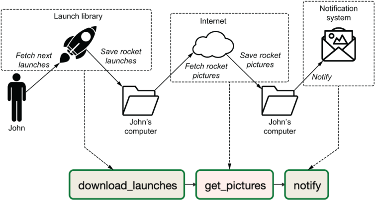

# A simple Airflow pipeline

Now that you are familiar with some of the common concepts in Airflow, let's try an example!

We've adapted a sample script that downloads rocket launch pictures and saves them in a folder and sends a notification: [download_rocket_launches.py](.assets/download_rocket_launches.py). We need to get it running in Airflow.

It follows the pipeline below,



_Source_: [Data Pipelines with Apache Airflow](https://github.com/BasPH/data-pipelines-with-apache-airflow)

You can choose to install Airflow in your system environment or create new environment for the installation (recommended). For Windows users, we suggest running Airflow using Docker. 

## Running on your local machine (Linux)

There are several steps to installing and running Airflow as a Python package from PyPi:

```pip install apache-airflow```

**Note:** Make sure you install apache-airflow and not just airflow. After joining the Apache Foundation in 2016, the PyPi airflow repository was renamed to apache-airflow. Since many people were still installing airflow instead of removing the old repository, it was kept as a dummy to provide everybody a message pointing to the correct repository.

After installing Airflow, start it by initializing the metastore (a database in which all Airflow state is stored), creating a user, copying the rocket launch DAG into the DAGs directory, and starting the scheduler and webserver:

1. `airflow db init`

2. `airflow users create --username admin --password admin --firstname Anonymous --lastname Admin --role Admin --email youremail@example.org`

3. `cp assets/download_rocket_launches.py ~/airflow/dags/`

4. `airflow webserver`

5. `airflow scheduler`

Note: the scheduler and webserver are both continuous processes that keep your terminal open, so either run in the background with airflow webserver and/or open a second terminal window to run the scheduler and webserver separately. 

After you’re set up, go to `http:/ /localhost:8080` and log in with username `admin` and password `admin` to view Airflow.

## Running on a Docker container (Linux and Windows Users)

Running Docker containers requires a Docker Engine to be installed on your machine. If you haven't already you should have installed Docker Desktop. 

**NOTE:** If you’re familiar with Docker, you would probably argue it’s not desirable to run multiple processes in a single Docker container as shown in listing 2.10. The command is a single command, intended for demonstration purposes to get up and running quickly. In a production setting, you should run the Airflow webserver, scheduler, and metastore in separate containers.


