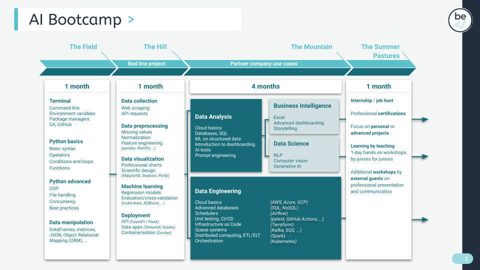

# BeCode AI Bootcamp

> Become a master in data

## ➡️ Overview
hhhhhhhhhh
The bootcamp's main purpose is to _bridge the gap_ between curious and solution-oriented _individuals_ and _companies_ in need of capable data people. We provide the most fundamental knowledge to the students so that they understand what AI is all about. We therefore eliminate unnecessary formalization as much as possible, so that the students advance fast in their quest and become practitioners real quick.

The ultimate goal is the mindset, not specific tools. For that reason, the timeline above may vary during the course and the tech mentioned might be replaced by others or not seen at all.

BeCode promotes a learning experience based on _projects rather than lessons_. With that in mind, the course content is divided into multiple categories of challenges, resources and other tools aiming to teach certain sets of skills.

### 🌱 The Field

- **Terminal**: Introduction to the fundamentals of the command line interface such as navigation, file operation, permissions, package management, re-directions, environment variables, with a particular focus on versioning tools like Git.
- **Python basics & advanced**: Introduction to the language fundamentals and then more complex (and interesting!) concepts such as functions, OOP, concurrency and best practices. The learned principles are required to work with all kinds of files that contain data.
- **Data manipulation**: Introduction to the shapes and formats data live in as well as all the necessary data preprocessing Python libraries such as [NumPy](https://numpy.org/) and [pandas](https://pandas.pydata.org/).

### 🏕️ The Hill

Through the infamous **Red Line project** you will roleplay in teams as a startup facing an end-to-end AI development lifecycle.

During a full month, you will collect data through scraping, process the data, analyse and visualize the data, make a machine learning model, and deploy the model as an API endpoint and as an actual web application. While going through these steps and iterating frequently, you will learn about the ins and outs of each aspect of the lifecycle.

### ⛰️ The Mountain

Time to pick a specialization! You will be able to choose between 3 different paths:

- **Business Intelligence Analyst**: Learn tools like Power BI and Tableau to analyse complex datasets in multiple formats (databases, spreadsheets, ...) and to create dashboards. Learn to find _and_ present the best insights from data by focusing on good and convincing storytelling.
- **Data Scientist**: Learn how to build and train models. Learn how to evaluate the performance of your models. Learn how to deploy your models in production.
- **Data Engineer**: Learn how to manipulate and maintain data efficiently. Learn the basics of the cloud and its tools (queuing, Kubernetes, scheduling, ...), and deploy models and databases with a scalable architecture.

### 🚠 The Summer Pastures

During the summer pastures, you have time to:
- Dive deeper into your technology or technologies of interest
- Work on your personal projects
- Share knowledge with the class
- (last but not least) **Go on job and internship hunting**!

As a continuous part of the training and to make it as practical as possible, learners will be faced on a daily to weekly basis to the below three types of activities: 

| Content      | Description |
| ------------------------------------------------- | -------------------------------------------------------- |
| Tech talks   | Small daily talks by the learners on theoretical concepts, interesting tech, projects, ...    |
| Workshops    | Interactive session given by the learner(s) on a subject they want to teach their colleagues  |
| Case studies | Study of real-life data and AI cases, well-known hacks, and advice from professionals         |

## ✨ How to thrive at BeCode?

Read the following documents:

1. Read the [pedagogical contract](https://github.com/becodeorg/BeCode/blob/master/educationalcontractAI.md)
2. If you need a refresher, here is the presentation about the [rules](https://docs.google.com/presentation/d/12NcwJp-x64T5kKnRDdwa1rN54Ab3BZhUUoT28Nv2K9o/edit#slide=id.p1)

## 🕑 Respect the planning: being late & absence

In case of **delay**, **absence** or **early leave** (planned or not), you will need to warn us.

Here is what you need to in those cases:
1. Send a message to _both_ coaches on Discord or by email
2. Warn BeCode through the Moodle platform:
   - If you already have a note to justify your absence (e.g. a doctor's note), attach this to the platform.
   - If you know that you are going to obtain such document, tell us and attach the document on the platorm once you have it.
   - Even when you have no legal reason for an absence or delay, still please let us know <abbr title="As Soon As Possible">ASAP</abbr> on Discord. Not showing up or showing up late is not nice and unprofessional.

As a [reminder](https://github.com/becodeorg/BeCode/blob/master/educationalcontractAI.md#sanctions):
- 2 unjustified occasions of being late or leaving early is seen as an absence
- 2 unjustified absences leads to a one-on-one conversation
- 6 unjustified absences leads to a termination of your contract with us (and the FOREM/VDAB/Bruxelles Formation) and results in you having to leave this training permanently
- If the absence rate (justified or not) exceeds 20%, BeCode may decide on the final exclusion of the learner

## 📅 Agenda

To keep up to date with the upcoming events, workshops and hackathons remember to check the **BeCode Global Discord server `#events` channel**!

## 🌴 Vacation and holidays

There are two vacation blocks during the training 👇

| Dates                                          | What are we doin'? |
| ---------------------------------------------- | ------------------ |
|  xx/xx/20xx - xx/xx/20xx                       | Planned vacation   |
|  xx/xx/20xx - xx/xx/20xx                       | Planned vacation   |

All **bank holidays** will be respected as well.

## 💡 Requirements

These are the minimal requirements for the learners:
- Junior development skills (preferably in Python but in any programming language should be fine)
- Basic math & statistics knowledge
- Fundamental computer knowhow (a minimal interest in tech and tech-savviness)
- Problem solver mindset
- Motivated
- Self-learner

## 👩‍🎓 Skills

With an ever-growing and changing set of _things to know_ we made choices so that, by the end of the training, the learner will have acquired the following technical foundations and soft skills.

### 💻 Tech skills

By the end of the common track (The Field and The Hill), all learners should have acquired a best practices _coding ability_ (in Python), knowledge of the fundamentals of _ΑΙ_ and _data science_ algorithms, and a basic affinity for the required _infrastructure_ in place to do AI (databases, pipelines, cloud, team management, ...). All of the knowledge will be grounded in the most modern tools and techniques available to date.

This general knowledge and thse competencies are enough to allow the learners to continue learning on their own and in the work place. The will have required the  to be able to understand and use the tools and techniques that will be used in the field.

### 😀 Soft skills

Throughout the bootcamp, the learners will have developed a series of valuable soft skills:
- CHANGE ENTHUSIAST: Flexible, solution mindset.
- COPYWRITER: Good at writing on a professional level.
- PUBLIC SPEAKER: Good at telling stories in front of an audience.
- CONTINUOUS LEARNER: Eager to learn, a "professional learner".
- RELIABLE: Trustworthy, committed, punctual.
- TEAM PLAYER: Helps, asks for help, takes its share of the collective load, gives and takes constructive feedback.
- TEAM LEADER: Inspires, storyteller, decision-taker.
- TEAM MANAGER: Organizes the team to maximise its output.
- SOLUTION-ORIENTED: Focuses on solving problems, sometimes originally.
- CUSTOMER-ORIENTED: Focuses on customer’s satisfaction.

### 🚀 Careers

With this training, our learners should be able to pursue the following career paths, to continue learning while acquiring battlefield experience:

- **Data Analyst / BI Expert**: Data Analysts sift through data and seek to identify trends. What stories do the numbers tell? What business decisions can be made based on these insights? In order to help their business stakeholders, they are experts in creating visual representations, from simple charts to interactive dashboards, to better showcase what the data reveals deep down.
- **Data Scientist**: Data Scientists are focused on the technical aspects of leveraging data, such as coding, algorithms, and machine learning. They are often responsible for collecting, cleaning, and munging data, as well as analyzing it, building models, and communicating insights. They may also be responsible for helping bring the machine learning models to production, together with **Machine Learning Engineers**.
- **Data Engineer**: Data Engineers develop, construct, test and maintain data pipeline architectures, such as databases and large-scale processing systems. They play an indispensable role in providing data analysts, data scientists, and companies at large with up-to-date and easily accessible data.

BeCode helps graduates find an internship, hopefully converting into a job that they like, and at the same time, help partner companies staff up with our autonomous, eager to learn and reliable talents.

Happy learning!
